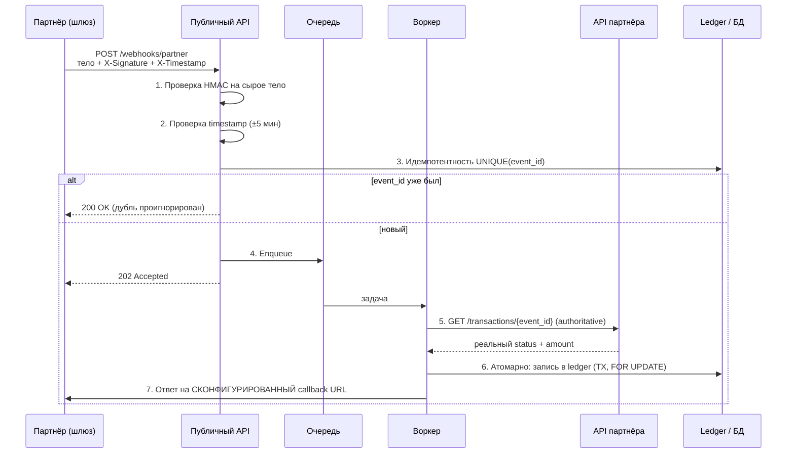

1. Дизайн безопасного Webhook-приемника
Пришла экспертиза со следующими вводными
"Сервис должен принимать уведомления о транзакциях (вебхуки) от внешнего платежного шлюза (партнера).
Планируем создать публичный (доступен в интернет) эндпоинт POST /api/v1/webhooks/partner. В теле приходит JSON: { "event_id": "...", "amount": 1000, "status": "SUCCESS", "callback_url": "..." }.
Аутентификацию не закладываем
Здесь:
event_id - уникальный идентификатор обытия
amount - сумма денежных средств на перевод
status - статус обработки на стороне партнера
callback_url - урл на который должны вернуть ответ о статусе операции
При получении сервис сразу обновляет баланс пользователя в БД и шлет подтверждение на callback_url.
Какие здесь есть риски безопасности? Как бы ты изменил схему?
2. На самом звонке покажу небольшой код на python, попрошу по нему назвать самые очевидные уязвимости и методы устранения
Ничего сложного или требующего глубокого погружения, тривиальный код


## 1. Риски исходной схемы

Главная проблема — **сервис доверяет данным из тела запроса и сразу двигает деньги, а эндпоинт открыт всему интернету без аутентификации.** Это фактически «печатный станок».

| # | Риск | Суть | Устранение |
|---|------|------|-----------|
| 1 | **Отсутствие аутентификации** | Любой может слать `POST` и начислять баланс | HMAC-подпись тела + shared secret, либо mTLS; IP-allowlist партнёра как доп. слой |
| 2 | **Нет проверки подлинности сообщения** | Нельзя доказать, что вебхук от партнёра | Заголовок `X-Signature: HMAC-SHA256(secret, timestamp + "." + raw_body)`, сверять на сырое тело до парсинга |
| 3 | **Replay-атака** | Перехваченный/легитимный `SUCCESS` шлётся N раз → двойное начисление | Идемпотентность по `event_id` (UNIQUE в БД) + окно по `timestamp` (напр. ±5 мин) + nonce |
| 4 | **Доверие `amount`/`status` из payload** | Партнёр «сообщает», а сервис слепо применяет | Вебхук трактовать как **сигнал**. По `event_id` дёрнуть authoritative API партнёра (server-to-server, аутентифицированно) и взять статус/сумму оттуда |
| 5 | **SSRF через `callback_url`** | URL из недоверенного тела, сервис сам на него ходит → `169.254.169.254`, `localhost`, внутренние админки | **Убрать `callback_url` из payload.** Адрес ответа — статически сконфигурирован на стороне сервиса per-partner. Если убрать нельзя — жёсткий allowlist схем/доменов + запрет приватных диапазонов |
| 6 | **Синхронная обработка → DoS** | «Сразу обновляет и шлёт подтверждение» — медленный callback/флуд кладёт сервис | Принять → провалидировать подпись → положить в очередь → отдать `202` за миллисекунды. Обработка в воркере |
| 7 | **Race condition на балансе** | Параллельные вебхуки одного юзера → потеря обновлений | Атомарный `UPDATE ... SET balance = balance + :amt` / `SELECT ... FOR UPDATE` / append-only ledger |
| 8 | **Слабая валидация** | `amount` отрицательный/дробный/огромный, нет `currency`, произвольный `status` | Строгая схема: `amount` — целое >0 в минорных единицах, обязательный `currency`, `status` из enum |
| 9 | **Нет rate-limit / нет ledger** | Публичный эндпоинт без лимитов; баланс правится напрямую без аудита | Rate-limit по IP/партнёру; вместо прямой правки баланса — **двойная запись в ledger**, баланс = проекция; отдельная сверка (reconciliation) |

## 2. Переработанная схема

**Payload** (без `callback_url`, добавлены `currency`, идемпотентность):
```json
{ "event_id": "uuid", "amount": 1000, "currency": "RUB", "status": "SUCCESS", "occurred_at": "2026-09-17T10:00:00Z" }
```
**Заголовки:** `X-Timestamp`, `X-Signature: sha256=<hmac>`.
**Ответ сервиса:** синхронно только `202 Accepted` (принято к обработке), никакого начисления в хендлере. Ответ о финальном статусе — на **заранее сконфигурированный** URL партнёра, а не из тела.

Вот диаграмма безопасного потока:Диаграмма безопасного потока (кликабельна — можно тыкать в узлы):Вот тот же поток в виде **готового Mermaid** — можешь вставить в Confluence/Notion/GitLab, или мне заменить на твою UML:



Если у тебя уже есть своя диаграмма/UML — пришли, и я впишу её в этот же контур (или переделаю под PlantUML/C4).

---

## Часть 2 — заготовка для ревью кода

Кода пока нет, поэтому вот чек-лист, по которому я быстро пройдусь на звонке, когда покажешь тривиальный Python. Самое частое, что «всплывает» в таком коде:

| Уязвимость | Как выглядит в коде | Устранение |
|-----------|---------------------|-----------|
| **SQL-инъекция** | f-строки/конкатенация в запросе: `f"SELECT ... WHERE id={uid}"` | Параметризованные запросы / ORM, никогда не форматировать SQL |
| **Command injection** | `os.system(...)`, `subprocess(..., shell=True)` с вводом | `subprocess.run([...], shell=False)`, без интерполяции |
| **SSRF** | `requests.get(user_url)` | Allowlist доменов, запрет приватных диапазонов |
| **Небезопасная десериализация** | `pickle.loads`, `yaml.load` | `json`, `yaml.safe_load` |
| **Хардкод секретов** | ключи/пароли в коде | Env-переменные / секрет-менеджер |
| **Слабое сравнение подписи** | `if sig == expected` | `hmac.compare_digest` (constant-time) |
| **Path traversal** | `open(base + user_path)` | Нормализация + проверка, что путь внутри base |
| **Отсутствие валидации/типизации** | приём JSON «как есть» | pydantic/схема, явные типы |
| **Раскрытие ошибок** | `debug=True`, трейсбек наружу | Прод-режим, логирование без утечки в ответ |

Кидай код — назову конкретные строки и фиксы.
